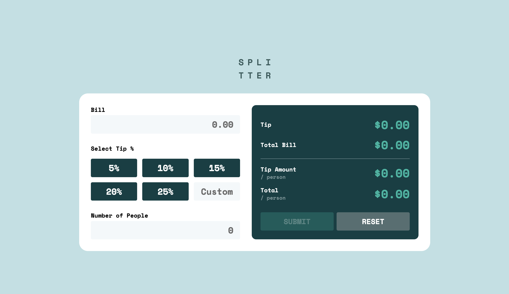

# Frontend Mentor - FAQ Accordion Card

Solution to the [Tip calculator app challenge](https://www.frontendmentor.io/challenges/tip-calculator-app-ugJNGbJUX) on [Frontend Mentor](https://www.frontendmentor.io)

[Live Site](https://alittlespoon.github.io/tip-calculator-app-main/)

### Built with

HTML, CSS, JavaScript

### Comments

- Added a section that displays the total tip and bill amount
- Added a submit button that is disabled by default and only enabled when all inputs are valid
